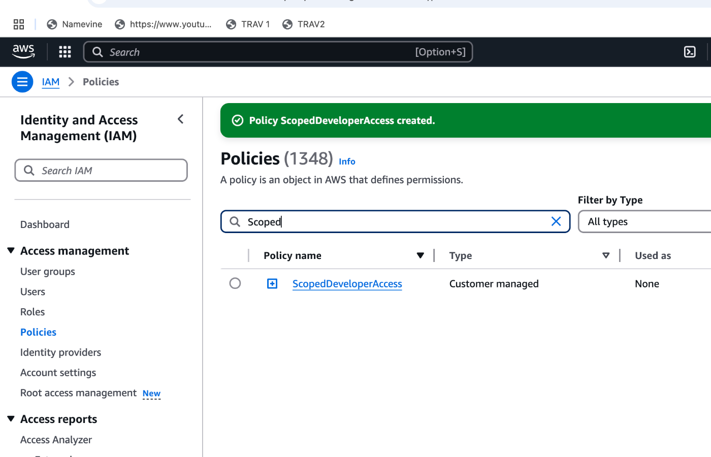
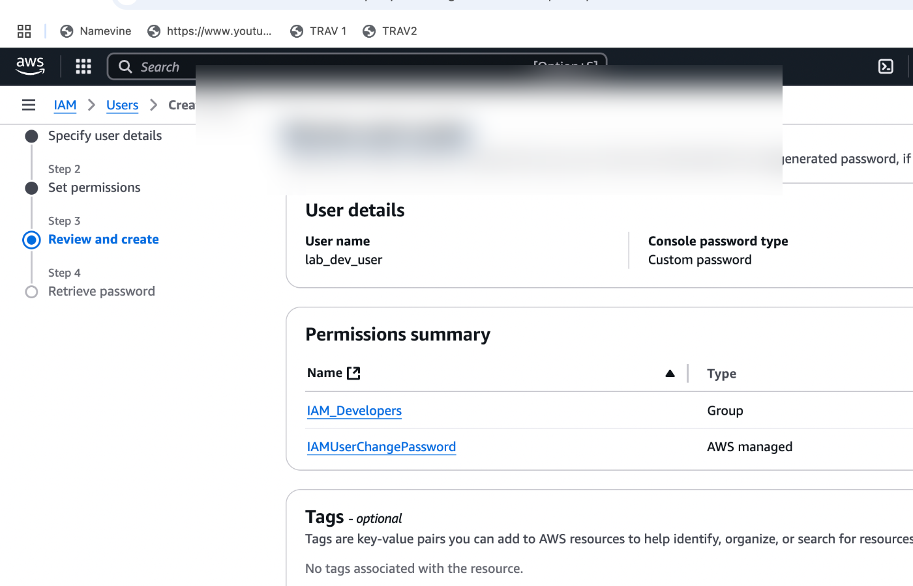

# IAM Hardening & Access Review Automation

This project implements real-world IAM hardening strategies and access governance automation in AWS. It simulates how a Cloud Security Engineer would secure and audit identity systems in a Zero Trust environment, aligning with DoD and enterprise compliance standards.

---

## Core Objectives

- Enforce **least-privilege IAM access** using groups and scoped policies
- Require **MFA for all IAM users**
- Enable **CloudTrail** for identity auditability
- Automate **access reviews** using credential reports and Lambda
- Flag identity risks such as missing MFA or unused credentials

---

## Project Structure

| Component                        | Purpose                                                                 |
|----------------------------------|-------------------------------------------------------------------------|
| IAM Groups & Policies            | Role-based access control (Admins, Auditors, Developers)               |
| Scoped Policy (`ScopedDeveloperAccess`) | Fine-grained access to EC2 + S3                                       |
| MFA Enforcement                  | Enabled MFA for all lab users using Authenticator App                   |
| CloudTrail                       | Multi-region logging for IAM activity                                  |
| Credential Report Analysis       | CSV-based review of password, access key, and MFA status               |
| Lambda Automation                | Flags IAM users who violate identity security baselines                |

---

## IAM Hardening Implementation

### IAM Dashboard with Account Alias

An account alias was created for a cleaner login experience and easier management.

### IAM User Groups Created

Established Admin, Auditor, and Developer IAM groups to enforce RBAC.

### Admin Group Permissions

Attached `AdministratorAccess` managed policy to the Admin group.

### Auditor Group Permissions

Attached `ReadOnlyAccess` managed policy to the Auditor group.

### Custom Developer Scoped Policy

Created a custom policy granting limited EC2 and S3 access for developers.

---

## IAM User Creation and MFA Enforcement

### Lab Users Created

Simulated user onboarding for Admin, Auditor, and Developer roles.

### MFA Setup for IAM Users

Multi-factor authentication (MFA) was enforced across all users to meet Zero Trust and DoD standards.

---

## CloudTrail and Access Review

### CloudTrail Enabled for IAM Events

Enabled CloudTrail with multi-region support to log and monitor IAM activity.

### IAM Credential Report Generated

Downloaded and analyzed credential reports to identify identity risks, such as users without MFA or unused credentials.

---

## IAM Access Review Automation (Lambda Function)

### Lambda Function Created

Set up a Python 3.12 Lambda function to automate credential report audits.

### Lambda Function Code Deployed

The Lambda pulls the latest IAM credential report, analyzes it, and flags non-compliant users.

### Lambda IAM Role Permissions Updated

Attached minimal required IAM permissions to Lambda role to enhance security.

### Lambda Test Output (Flagged Users)

Lambda output displaying users without MFA or login activity, logged securely to CloudWatch.

---

## Technologies Used

- AWS IAM
- AWS Lambda (Python 3.12)
- AWS CloudTrail
- AWS CloudWatch Logs
- AWS S3 (optional future enhancement)
- boto3 SDK

---

## Security Concepts Demonstrated

- IAM RBAC enforcement
- MFA policy governance
- Zero Trust identity boundaries
- Credential lifecycle reviews
- Serverless auditing via Lambda
- IAM automation aligned with DoD 8570/8140 tasks

---

## Deliverables & Proof

- Screenshots of IAM group creation, policy attachments, MFA setup
- Credential Report CSVs with findings
- Lambda execution logs
- GitHub-hosted code for Lambda function
- CloudTrail verification with logging status

---

## Status

- RBAC and MFA enforced  
- CloudTrail enabled  
- Credential report audited  
- IAM Lambda automation tested and deployed  

---

## Next Steps

- Export flagged users to S3 or email via SNS
- Integrate with AWS Config or Security Hub
- Implement automated remediation (disable stale users)

---

## Author

**Courtney Gonsalves**  
AWS Certified | Security+ | IAM Cloud Security Track  
GitHub: [github.com/courtneygons](https://github.com/courtneygons)

